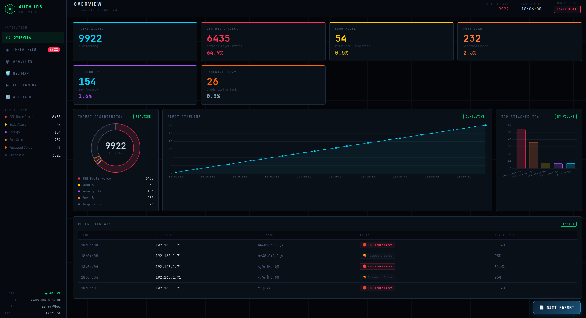

# 🛡️ Linux Authentication IDS (Auth-IDS)

A real-time Intrusion Detection System that watches Linux authentication logs and alerts you the moment an attack begins — powered by a Random Forest ML model.

## What Problem Does It Solve?

Linux servers are constantly targeted by SSH brute force, privilege escalation, port scanning and foreign access attempts. Most administrators only find out after the damage is done. Auth-IDS monitors your system 24/7 and catches attacks as they happen.

## What It Does

- 🔴 **SSH Brute Force Detection** — Catches repeated failed login attempts from attackers using tools like Hydra
- 🟡 **Privilege Escalation Detection** — Flags unauthorised sudo usage and privilege abuse attempts
- 🟣 **Foreign IP Detection** — Alerts when login attempts come from unexpected geographic locations
- 🟠 **Port Scan Detection** — Identifies reconnaissance scans from nmap before a real attack begins
- 🔫 **Password Spray Detection** — Catches slow credential attacks targeting multiple usernames with one password
- 📊 **Live Web Dashboard** — 6-tab interface with real-time threat feed, charts and world attack map
- 📲 **Instant Slack Alerts** — Notifies your Slack channel the moment a threat is detected
- 📄 **NIST Incident Reports** — Generates PDF reports following NIST SP 800-61 Rev 2 standard
- 🌍 **GeoIP World Map** — Visualises attacker locations on an interactive world map

## How It Works
```
/var/log/auth.log
       ↓
   monitor.py        watches log file every 3 seconds
       ↓
   parser.py         extracts features from each log line
       ↓
   detector.py       Random Forest ML model classifies the threat
       ↓
   database.py       stores alert in SQLite
       ↓
   slack_notify.py   sends instant Slack notification
       ↓
   dashboard         displays live on web interface
```

## ML Model

| Property | Detail |
|---|---|
| Algorithm | Random Forest |
| Trees | 100 |
| Features | 39 |
| Training Records | 5,026 balanced samples |
| Test Accuracy | 100% |
| Output | Threat type + confidence score (0-100%) |

## Project Structure
```
Auth_IDS/
├── app.py                  # Flask server & API endpoints
├── monitor.py              # Real-time log watcher
├── parser.py               # Log parser (11 regex patterns)
├── detector.py             # Random Forest ML detection engine
├── database.py             # SQLite alert storage
├── slack_notify.py         # Slack webhook notifications
├── report_generator.py     # NIST SP 800-61 Rev 2 PDF generator
├── linux_auth_model.pkl    # Trained ML model
├── model_columns.pkl       # 39 feature columns
└── dashboard/
    ├── index.html          # 6-tab dashboard UI
    ├── style.css           # Dark theme styling
    └── app.js              # Real-time charts and polling
```

## Installation
```bash
git clone https://github.com/abhisek-bhattarai/SIEM-System.git
cd SIEM-System
python3 -m venv venv
source venv/bin/activate
pip install -r requirements.txt
sudo python3 app.py
```

Open browser at http://localhost:5000

## Configuration

Add your Slack webhook in slack_notify.py:
```python
WEBHOOK_URL = "https://hooks.slack.com/services/YOUR/WEBHOOK/HERE"
```

## API Endpoints

| Endpoint | Description |
|---|---|
| GET / | Live dashboard UI |
| GET /api/health | System health check |
| GET /api/stats | Full alert statistics |
| GET /api/alerts | Last 100 alerts |
| GET /api/alerts/live/<id> | Real-time polling every 4s |
| GET /api/generate-report | Download NIST PDF report |

## Live Detection Results

Captured on 24 February 2026 during live deployment on Ubuntu 24.04 LTS with Kali Linux as the attacking machine.



| Threat Type | Alerts | Share |
|---|---|---|
| 🔴 SSH Brute Force | 6,435 | 64.9% |
| ⚫ Suspicious Activity | 2,982 | 30.1% |
| 🟠 Port Scan | 232 | 2.3% |
| 🟣 Foreign IP | 154 | 1.6% |
| 🟡 Sudo Abuse | 54 | 0.5% |
| 🔫 Password Spray | 26 | 0.3% |
| Total | 9,922 | 100% |

## System Requirements

- Ubuntu 20.04 / 22.04 / 24.04
- Python 3.10+
- Read access to /var/log/auth.log
- Minimum 2GB RAM

## Tech Stack

| Layer | Technology |
|---|---|
| Backend | Python 3.12, Flask |
| ML | scikit-learn Random Forest |
| Database | SQLite |
| Frontend | JavaScript, Chart.js, Leaflet.js |
| Alerts | Slack Webhooks |
| Reports | ReportLab PDF |
